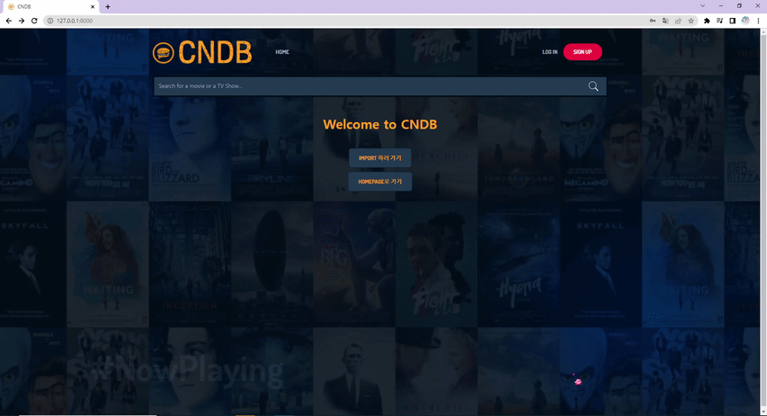
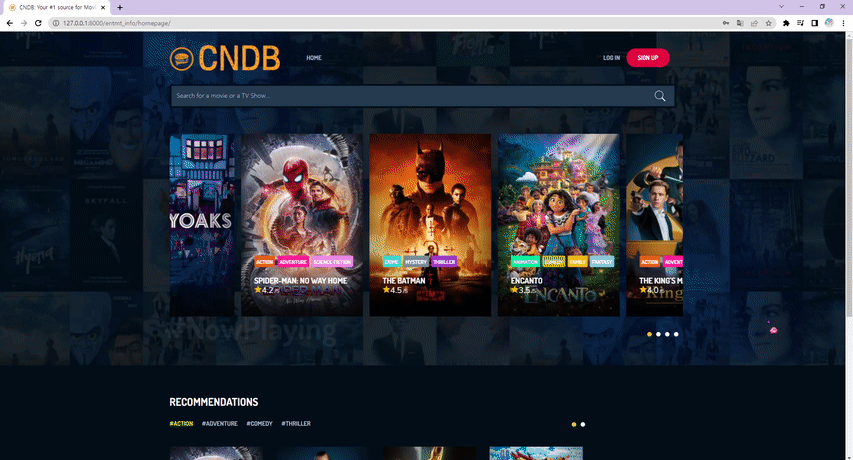
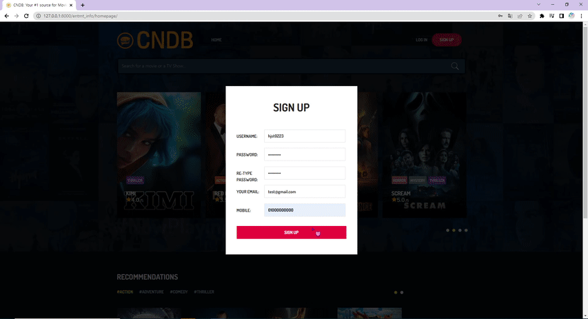

# Project : CNDB(Cheese Nacho Database) 
## - Ratings and Reviews for TV series and movies around the world


2022-03-14 MultiCampus 인터페이스 개발 프로젝트 2등

기간 : `2022/02/22`~`2022/03/14`

 

## 1. CNDB 소개
TV시리즈와 영화 모두를 아우르는 한국형 Media 검색•리뷰 등록 사이트로, TV 시리즈와 영화를 함께 다루지 않는 국내 Media DB 사이트들의 한계점을 보완하였다. TMDB의 데이터를 기반으로 한국뿐만 아니라 전세계의 TV 시리즈와 영화에 대해 각 사용자마다 리뷰를 등록하고 관리할 수 있도록 구현하였다.  

## 2. Data
### 2-1. 로컬 DB
TMDB에서 2022년 2월 25일까지의 tv시리즈와 영화 데이터 중 popularity 기준 상위 200개 추출 후 로컬 DB에 저장하여 사용

### 2-2. TMDB의 검색 api를 사용하여 검색 결과 수집


## 3. Tools
 


 


[TMDB API](https://www.themoviedb.org/?language=ko)

## 4. Models
** 폴더 내용 **

```bash
├── cndb 			# project main
├── mntmt_info		# project import, orm
│   ├── data		# base web page data
│   ├── models		# Movie, Series, Genre original data
│   ├── views		# import, orm 등 전체적인 기능을 담당		
│   └── templates	# main 페이지, 검색결과 페이지등
├── entmt_manage
│   ├── models		# Movie, Series의 Comment, Genre
│   └── views		# like 등 Movie, Series의 부가 정보 기능 담당
├── users
│   ├── models		# Member,  Member의 like, genre
│   ├── views		# Member의 전체적인 정보 기능 담당
│   └── templates	# userpage, login page 등
└── templates		# base.html, navbar.html
```

** models 소개 **

| Movie         | Series         | Genres |
| ------------- | -------------- | ------ |
| m_id          | s_id           | g_id   |
| m_title0      | s_title        | g_name |
| m_posterPath  | s_posterPath   |        |
| m_likeCount   | s_likeCount    |        |
| m_releaseDate | s_firstAirDate |        |
| m_popularity  | s_lastAirDate  |        |
|               | s_popularity   |        |

| class Members | class Mlike  | class Slike   | class Ugenres |
| ------------- | ------------ | ------------- | ------------- |
| u_mobile      | ml_user (F)  | sI_user(F)    | ug_user (F)   |
| u_image       | ml_movie (F) | sl_series (F) | ug_genre (F)  |

| class Mcomment | class Scomment | class Mgenres | class Sgenres |
| -------------- | -------------- | ------------- | ------------- |
| mc_star        | sc_star        | mg_movie (F)  | sg_series (F) |
| mc_content     | sc_content     | mg_genre (F)  | sg_genre (F)  |
| mc_user (F)    | sc_user (F)    |               |               |
| mc_movie (F)   | sc_series (F)  |               |               |
| mc_date        | sc_date        |               |               |

## 5. Function
#### A. 주요 기능

1. API 활용 영화 순위, 세부 내용 제공
2. 회원가입 및 회원정보 변경 기능 구현
3. 회원 인증 후 별점, 리뷰 등록 등 댓글 기능 구현
4. 사용자 별 선호 장르를 참고한 TV 시리즈 및 영화 추천
5. TV 시리즈 및 영화 제목 검색 기능 (API) 구현

#### B. 세부기능

**TMDB api** : 영화 정보 검색 api 제공 사이트

- 영화(시리즈) 고유번호 다운로드 api
- 장르 목록 다운로드 api
- 영화(시리즈) detail 다운로드 api
- 키워드 검색 api

**import data**

- 페이지 구동 시 기본적으로 필요한 장르 다운로드 기능
- 페이지 구동 시 기본적으로 필요한 영화/시리즈 정보 다운로드 기능

**navbar**

- 로고 클릭 시 home으로 이동
- 팝업폼을 이용한 회원가입, 로그인, 로그아웃 기능
- mypage를 클릭 시 mypage로 이동
- 검색기능을 사용하여 영화(시리즈) 검색 

**main page**

- (맨 위쪽 슬라이더, 탭) TV 시리즈/영화 (popularity기준) 인기순위로 출력(장르 함께 출력)
- (아래쪽 슬라이더, 탭) 회원가입 시 선택한 장르별 인기 TV 시리즈/영화 추천 기능 

**research page**

- 검색어를 입력해서 관련 영화, 시리즈 검색결과(평균 별점 포함) 출력
- TV시리즈/영화의 제목, 포스터를 클릭 시 detail 페이지로 이동

**detail page**

- TV시리즈/영화의 제목, 포스터를 클릭하면 영화의 세부 사항을 출력
- TV시리즈/영화 좋아요 기능 (로그인 시 활성화)
- TV시리즈/영화에 대한 리뷰, 별점 등록/수정/삭제 기능 (로그인 시 활성화)
- 별점을 통계내어 각 TV시리즈/영화의 평균 별점 표시
- 로그인한 회원의 리뷰와 다른 회원들의 리뷰를 구분해서 표시(모든 리뷰를 볼 때는 로그인한 회원의 리뷰가 최상단에 오도록 구현)

**mypage** (로그인 시 활성화)

- favorite media : 내가 좋아요한 영화 목록 출력
- my ratings : 내가 작성한 리뷰 목록 출력
- profile : 프로필 이미지 설정(css로 커스텀, files 형식), 회원정보 업데이트(폼 형식으로 전달 후 저장)
- my preference : 최초 회원가입 시 선호 장르 선택, 이후 업데이트 가능
- change password : 사용자에게 변경할 비밀번호 입력받은 후 유효성 검증 실행


## 6. Demo
### 6-1. import data

---
### 6-2. 회원가입	

---
### 6-3. 회원가입 후 선호장르 선택

---
### 6-4. 로그아웃 후 검색 - 디테일 페이지 접속 (리뷰입력 폼 비활성화, 좋아요 기능 비활성화)

---
### 6-5. 로그인 오류 시 절차

---
### 6-6. 로그인 후 검색하고 디테일 페이지 접속

---
### 6-7. 디테일 페이지에서 리뷰 작성 후 리뷰 확인

---
### 6-8. 좋아요 등록

---
### 6-9. 마이페이지에서 좋아요 등록한 목록 확인

---
### 6-10. 좋아요 등록한 미디어에 대한 리뷰 작성

---
### 6-11. ratings에서 작성한 리뷰 확인

---
### 6-12. 회원 정보 변경
#### a. 프로필 사진 변경

#### b. 프로필 정보 변경

#### c. 비밀번호 변경

---
### 6-13. 선호장르 업데이트 시 변경되는 추천 미디어 목록 (ex.adventure => horror)
#### a. adventure

#### b. horror

---
### 6-14. 메인화면 탭

